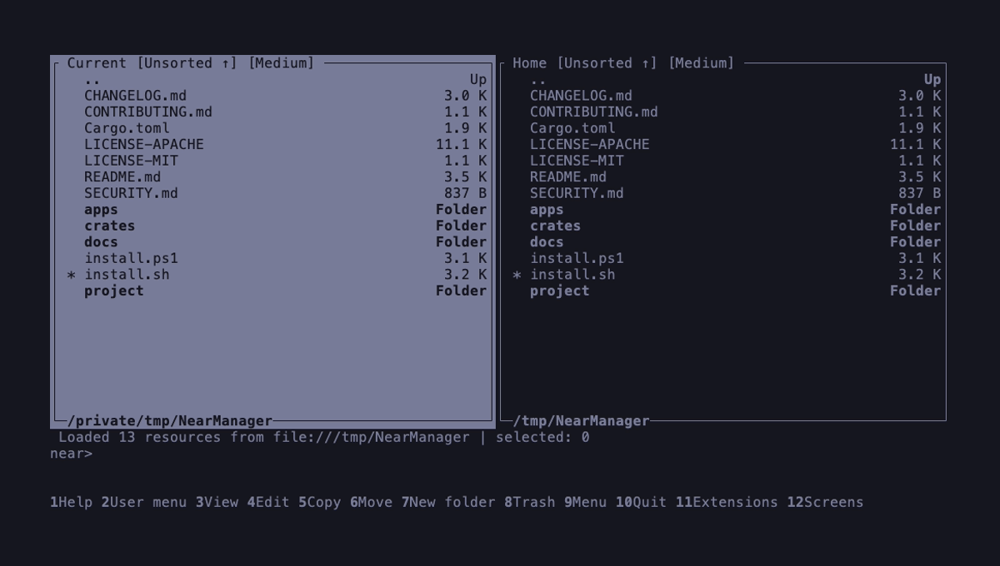

# Near Manager

[](https://github.com/juanandresgs/NearManager/actions/workflows/ci.yml)
[](https://github.com/juanandresgs/NearManager/releases/latest)
[](https://www.rust-lang.org/)
[](#license)

Near Manager is a fast, keyboard-first terminal file manager for working across files, remote systems, archives, processes, and command-line tools without leaving a cohesive two-panel workspace.



## Install

macOS and Linux:

```sh
curl --proto '=https' --tlsv1.2 -LsSf https://raw.githubusercontent.com/juanandresgs/NearManager/main/install.sh | sh
```

Windows PowerShell:

```powershell
irm https://raw.githubusercontent.com/juanandresgs/NearManager/main/install.ps1 | iex
```

The installer detects the operating system and CPU architecture, verifies the release checksum, installs the Near Manager tools, and configures a user-local command path. Then open a new terminal and run:

```sh
near-fm
```

See the [installation guide](docs/INSTALL.md) for supported targets, manual verification, and building from source.

## What it does

- Navigates local files, archives, SFTP locations, processes, search results, and other provider-backed resources.
- Keeps two independent panels, persistent screens, embedded terminals, quick view, and file information within one workspace.
- Includes streaming text and hex viewing, an internal editor, recursive search, filtering, sorting, histories, shortcuts, and configurable file associations.
- Previews copy, move, rename, link, trash, delete, wipe, and attribute changes before execution, with recovery-aware operation tracking.
- Supports mouse and keyboard workflows while retaining a Far-style command language for experienced terminal users.
- Uses layered, inspectable configuration for themes, keymaps, handlers, menus, macros, panel modes, and connections.

## Why Near Manager

Near Manager is built for people who live in terminals but need more context and safer operations than a sequence of shell commands provides. Its resource model gives local files and non-file resources the same navigable interface, while explicit plans and semantic status keep consequential actions understandable.

The application also proves a reusable Rust TUI stack. Shared crates own terminal lifecycle, semantic rendering, commands, tasks, collection mechanics, provider contracts, and test tooling; Near Manager owns the file-management workflow and policy. That separation keeps the application cohesive without trapping generally useful interaction mechanics inside it.

Near Manager is pre-release software. macOS is the primary proving platform; Linux and Windows receive native builds and automated portability coverage. See the [latest release](https://github.com/juanandresgs/NearManager/releases/latest) for current artifacts and notes.

## Development

```sh
git clone https://github.com/juanandresgs/NearManager.git
cd NearManager
cargo run -p near-fm --locked
```

Contributions are welcome. Start with [CONTRIBUTING.md](CONTRIBUTING.md); architecture and validation documents live under [`docs/`](docs/) and [`project/`](project/).

## License

Near Manager is available under either the [Apache License 2.0](LICENSE-APACHE) or the [MIT License](LICENSE-MIT), at your option.
