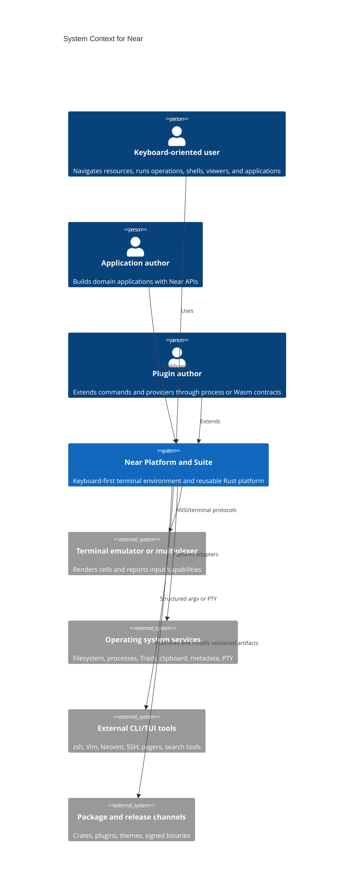
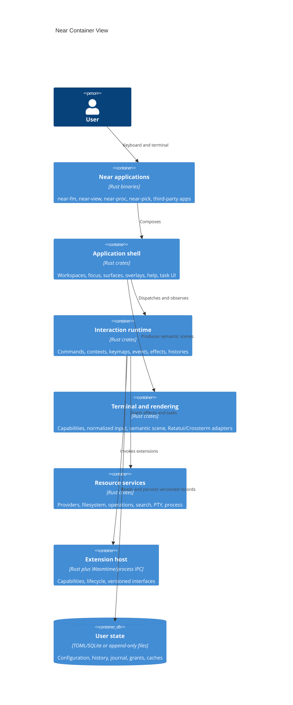
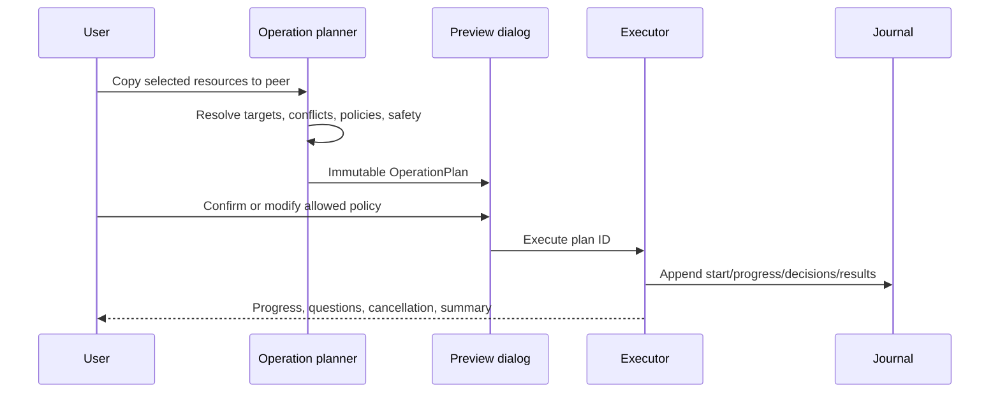
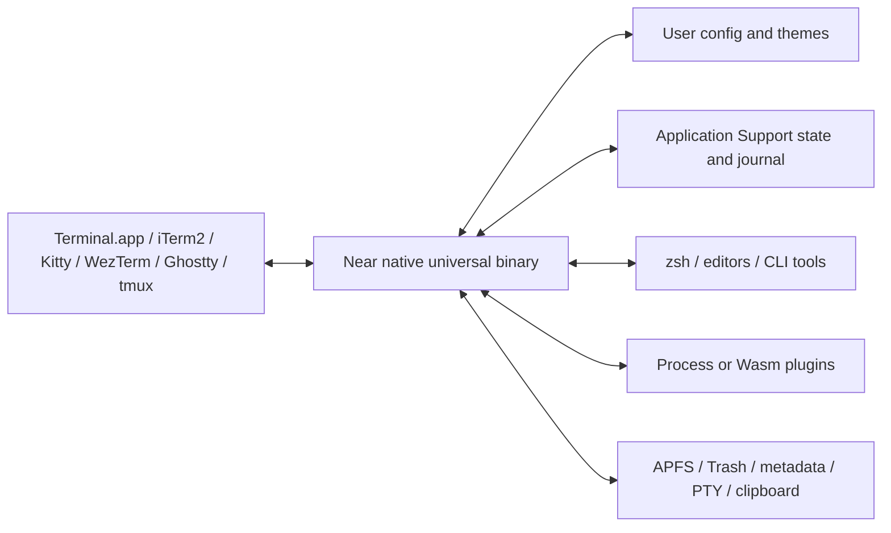

# Near Architecture Record

This document follows the arc42 concern structure and uses C4 abstractions for diagrams. It complements, rather than repeats, `docs/near-platform-blueprint.md`.

## 1. Introduction and Goals

Near is a Rust platform for creating cohesive keyboard-first terminal applications. Its defining abstraction is semantic commands operating on contextual resources through composable surfaces and user-defined keymaps.

Top quality goals, in priority order:

1. **Safety:** destructive operations and extension capabilities cannot silently exceed reviewed intent.
2. **Interaction immediacy:** keyboard input produces predictable, low-latency feedback.
3. **Extensibility:** applications and providers reuse stable contracts without inheriting file-manager assumptions.
4. **Reliability:** terminal, task, filesystem, and plugin failures remain recoverable and diagnosable.
5. **Portability:** macOS is complete first; platform-specific behavior remains behind explicit capabilities.

Stakeholders:

| Stakeholder | Primary expectation |
|---|---|
| Keyboard-oriented user | Fast, discoverable, consistent operation without mouse dependence |
| Application author | Small reusable API independent of terminal backend and file manager internals |
| Plugin author | Versioned contracts, clear capabilities, diagnostics, and isolation |
| Maintainer | Traceable requirements, modular ownership, deterministic tests, and compatible evolution |
| Security reviewer | Explicit trust boundaries, threat model, least privilege, and release evidence |

## 2. Constraints

- Rust is the implementation language.
- macOS and zsh are the first complete environment.
- The public platform API does not expose Ratatui or Crossterm.
- Ordinary functionality does not require shell startup-file modification.
- Plugins do not use native dynamic libraries as the stable third-party ABI.
- Terminal and filesystem behavior must degrade through capabilities rather than hidden assumptions.
- Requirements and decisions are maintained as version-controlled project records.

## 3. Context and Scope

### System context



### Scope boundary

Inside Near:

- Terminal lifecycle, normalized input, semantic rendering, command/keymap/theme runtime.
- Application shell and reusable surfaces.
- Resource/provider contracts and first-party providers.
- Task, operation, configuration, plugin, diagnostics, and application APIs.

Outside Near:

- Terminal emulator implementation.
- Full reimplementation of mature editors and shells.
- Operating-system kernel services.
- Unrestricted execution or capabilities for untrusted plugins.

## 4. Solution Strategy

- Wrap Ratatui and Crossterm behind semantic scene and terminal adapters.
- Model all behavior as commands and all navigable domain objects as resources.
- Use a single-owner event/update/effect runtime with asynchronous services.
- Derive discoverability from effective keymaps.
- Separate operation planning from execution.
- Ship suspend-and-run before embedded PTY.
- Validate abstractions using a file manager, viewer, and non-filesystem application.
- Stabilize Rust APIs before publishing a smaller WIT plugin surface.

## 5. Building Block View

### Container view



### Dependency rule

Dependencies point downward through these logical layers:

```text
applications
  -> application facade / shell
  -> runtime / UI / command / keymap / theme
  -> resource and platform services
  -> terminal and rendering adapters
  -> third-party crates and operating system
```

Lower layers never import application crates. Providers never mutate surfaces directly. Renderers never dispatch domain commands. Plugins never receive the full application model.

## 6. Runtime View

### Command invocation

```mermaid
sequenceDiagram
  participant T as Terminal adapter
  participant K as Keymap resolver
  participant C as Command registry
  participant M as Model/update loop
  participant S as Async service
  participant R as Renderer

  T->>K: Normalized KeyStroke + context stack
  K->>C: CommandInvocation
  C->>C: Check availability and safety
  C->>M: Effects
  M->>S: Start cancellable task
  S-->>M: Progress/result with generation ID
  M->>M: Reject stale events; update model
  M->>R: Semantic scene
  R-->>T: Cell diff
```

### Planned file operation



## 7. Deployment View

### macOS first deployment



Release artifacts target Apple Silicon first and Intel macOS where sustainable. Linux and Windows use the same logical containers with different platform adapters and packaging.

## 8. Crosscutting Concepts

- Stable namespaced identifiers for commands, contexts, roles, providers, handlers, and capabilities.
- Versioned serialization for all persisted or exchanged records.
- Cancellation, generation IDs, and bounded channels for asynchronous work.
- Semantic roles and explicit fallback for visual meaning.
- Structured argv and explicit shell evaluation.
- Typed errors and structured tracing with redaction.
- Capability-driven platform and plugin behavior.
- Test backends, fake providers, fake clocks, and workflow scripts.
- Migrations that preserve user configuration and explain incompatible changes.

## 9. Architecture Decisions

See `project/decisions/`. Accepted decisions currently cover project governance, semantic commands/resources, keymap language, themes, rendering substrate, PTY sequencing, and extension tiers.

## 10. Quality Requirements

Normative quality requirements live in `project/requirements.toml`. The highest-impact scenarios are:

- Terminal restoration after failures.
- p95 keyboard navigation latency under 16 milliseconds on the reference setup.
- Initial rendering without eager full-directory metadata.
- Exact outcomes after cancelled or partially failed operations.
- Non-color representation of critical state.
- Plugin failure isolation and denied ambient authority.
- Compatible Rust and WIT interface evolution.

## 11. Risks and Technical Debt

| Risk | Current response |
|---|---|
| Framework designed before product evidence | Extract only after multiple applications validate contracts |
| Terminal protocol variability | Capability probing, fixtures, matrix, and fallback |
| Filesystem data loss | Plan/execute split, Trash default, journal, fault injection |
| Embedded PTY scope | Reliable suspend-and-run ships first |
| Plugin ABI churn | Delay WIT publication and use version/feature gates |
| Documentation divergence | Schema-checked requirements and traceability CI |
| Async stale state | Single-owner model and generation IDs |

## 12. Glossary

| Term | Meaning |
|---|---|
| Command | Stable semantic unit of behavior independent of a key or menu |
| Context | Ordered scope used for key resolution and command availability |
| Resource | Provider-neutral navigable or actionable domain object |
| Provider | Service that lists, inspects, opens, or operates on resources |
| Surface | Composable interactive presentation of resources or application state |
| Peer | Optional related surface supplying destination or comparison context |
| Scene | Backend-independent semantic render description |
| Role | Theme-resolved semantic visual identifier |
| Effect | Declared consequence returned by command/model update |
| Task | Long-running cancellable operation reporting progress and outcome |
| Evidence | Artifact proving a requirement's acceptance criteria |

